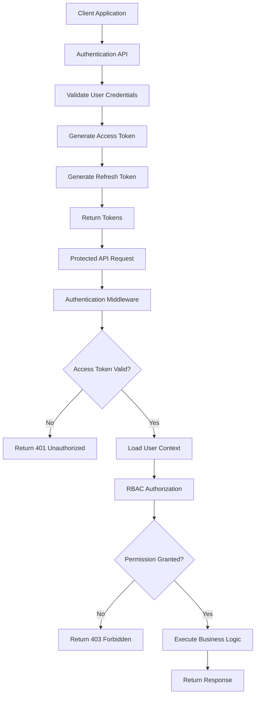
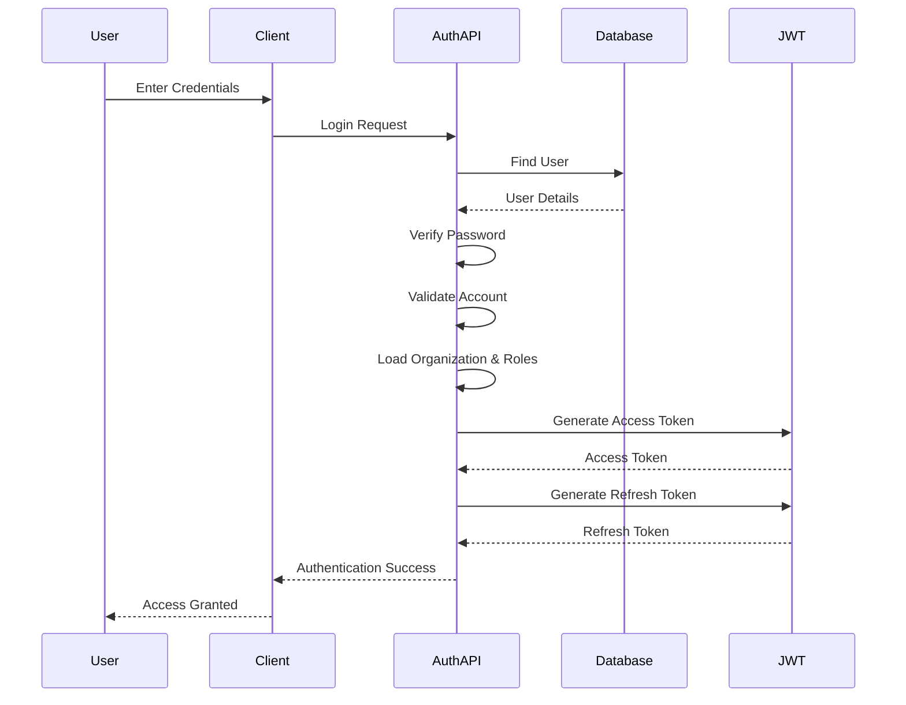
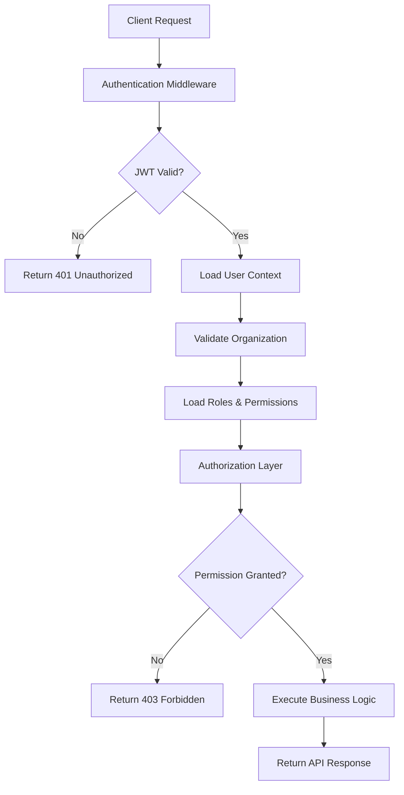

# Authentication & Authorization Architecture

## 1. Overview

Authentication and Authorization are fundamental security components of the NexusAI platform, responsible for verifying user identities and controlling access to protected resources. Together, they ensure that only authenticated users can access the platform and that every action performed within the system is governed by predefined roles and permissions.

NexusAI is designed as a multi-tenant enterprise AI platform where multiple organizations share a common infrastructure while maintaining complete isolation of users, documents, AI conversations, knowledge bases, and system resources. Every authenticated request is associated with a specific organization, ensuring that users can access only the data belonging to their tenant.

The platform adopts a stateless authentication architecture based on JSON Web Tokens (JWT), eliminating the need for server-side session storage and enabling seamless horizontal scaling. Authorization is implemented using a Role-Based Access Control (RBAC) model, allowing organizations to manage user permissions efficiently while following the principle of least privilege.

This document describes the complete authentication and authorization architecture of NexusAI, including authentication workflows, request validation, JWT lifecycle, role management, tenant isolation, and security practices. It serves as the primary reference for implementing and maintaining the authentication subsystem across the platform.

## 2. Design Principles

The authentication system has been designed using modern security standards and enterprise architecture principles to ensure reliability, scalability, and maintainability.

### Security First

Every protected request must be authenticated and authorized before accessing business resources. Security validation always occurs before any application logic is executed.

### Stateless Authentication

Authentication is based on signed JSON Web Tokens (JWT) instead of server-side sessions. This enables the application to scale horizontally without requiring shared session storage.

### Least Privilege Access

Users are granted only the permissions required to perform their assigned responsibilities. Access decisions are based on roles rather than individual users, reducing security risks and simplifying permission management.

### Tenant Isolation

Every authenticated request is associated with a specific organization. Users, documents, AI conversations, and knowledge bases remain completely isolated between tenants.

### Scalability

The authentication architecture supports distributed deployments where multiple application instances can validate JWT tokens independently without maintaining shared authentication state.

### Extensibility

The authentication framework is designed to support future enhancements such as OAuth providers, Single Sign-On (SSO), Multi-Factor Authentication (MFA), Passkeys, and external identity providers without significant architectural changes.

### Auditability

Authentication events including login attempts, token refresh operations, password changes, and authorization failures are designed to be logged for monitoring, auditing, and compliance purposes.

## 3. Authentication Architecture

The NexusAI authentication system follows a layered architecture that separates authentication, authorization, business logic, and data access into independent components. Every protected request passes through these layers before reaching the requested service.

The authentication process begins when a user submits valid credentials to the Authentication API. After successful verification, the system generates a signed Access Token and a Refresh Token. The Access Token accompanies every protected API request and is validated by the Authentication Middleware before the request proceeds further.

Once the user's identity has been verified, the Authorization Layer evaluates the user's assigned role and permissions using the Role-Based Access Control (RBAC) model. Only authorized requests are forwarded to the application services, ensuring that every resource is protected by centralized access control.

This layered architecture improves maintainability, simplifies security enforcement, and provides a consistent authentication workflow across all backend services.

### Authentication Components

| Component | Responsibility |
|-----------|----------------|
| Authentication API | Handles login, logout, registration, password reset, and token refresh requests. |
| JWT Service | Generates, signs, validates, and decodes JWT tokens. |
| Authentication Middleware | Verifies token integrity, expiration, and authenticity for every protected request. |
| Authorization Layer | Evaluates user roles and permissions before granting access to protected resources. |
| User Service | Retrieves user profile, account status, organization membership, and assigned roles. |
| Token Manager | Manages access token generation, refresh token validation, expiration, and revocation. |
| Password Service | Securely hashes and verifies user passwords using industry-standard hashing algorithms. |
| Audit Logger | Records authentication and authorization events for security monitoring and compliance. |

## 4. High-Level Authentication Flow

Every protected request within the NexusAI platform follows a standardized authentication and authorization pipeline before reaching the application services. This layered validation process ensures that only authenticated and authorized users can access protected resources while maintaining strict tenant isolation.

The authentication flow begins when a user submits valid credentials through the Authentication API. Upon successful verification, the system issues an Access Token and a Refresh Token. The Access Token is then included in every subsequent API request and is validated by the Authentication Middleware before the request proceeds to the authorization layer.

If the token is valid, the user's identity, organization, role, and permissions are loaded into the request context. The Authorization Layer then evaluates whether the requested operation is permitted. Only after all validation steps are completed successfully is the request forwarded to the corresponding business service.



This architecture centralizes authentication and authorization, ensuring consistent security enforcement across all backend services while allowing the application to scale efficiently in distributed environments.

## 5. User Login Flow

The User Login Flow is responsible for authenticating users and establishing a secure session using JWT-based authentication. The login process validates user credentials, verifies account status, determines organizational membership, and generates authentication tokens required for accessing protected resources.

Once authentication is successful, the platform issues a short-lived Access Token and a long-lived Refresh Token. The Access Token is attached to every protected API request, while the Refresh Token is used to obtain a new Access Token after expiration without requiring the user to authenticate again.

### Login Workflow

1. The user enters their email address and password.
2. The client sends a login request to the Authentication API.
3. The system validates the request payload.
4. The user account is retrieved from the database.
5. The submitted password is verified against the stored password hash.
6. The user's account status is validated.
7. The associated organization is verified.
8. User roles and permissions are loaded.
9. A signed JWT Access Token is generated.
10. A Refresh Token is generated and stored securely.
11. Both tokens are returned to the client.
12. The client includes the Access Token in the Authorization header for all subsequent protected requests.

### Login Sequence Diagram



### Successful Login Response

After successful authentication, the server returns:

- Access Token
- Refresh Token
- Access Token Expiration Time
- User Identifier
- Organization Identifier
- Assigned Role
- Basic User Profile Information

## 6. JWT Token Architecture

NexusAI uses JSON Web Tokens (JWT) to implement stateless authentication across the platform. JWT enables secure identity verification without maintaining server-side session state, making the authentication system scalable and suitable for distributed deployments.

Two types of tokens are issued after successful authentication:

- **Access Token** – Used to authenticate protected API requests.
- **Refresh Token** – Used to obtain a new Access Token after expiration.

### JWT Structure

A JWT consists of three components:

```text
Header
Payload
Signature
```

- **Header** contains the signing algorithm and token type.
- **Payload** stores user-related claims.
- **Signature** ensures the integrity of the token and prevents tampering.

### JWT Claims

Each Access Token contains the following claims:

| Claim | Description |
|--------|-------------|
| sub | Unique User Identifier |
| email | User Email Address |
| organization_id | Organization Identifier |
| role | Assigned User Role |
| permissions | User Permissions |
| iat | Token Issued Time |
| exp | Token Expiration Time |

### Access Token

The Access Token is included in every authenticated API request using the following HTTP header:

```http
Authorization: Bearer <access_token>
```

The Authentication Middleware validates the token signature, expiration time, and payload before allowing access to protected resources.

### Refresh Token

Refresh Tokens are used to generate new Access Tokens without requiring users to log in again. Refresh Tokens have a longer validity period and are securely stored by the client.

When the Access Token expires, the client sends the Refresh Token to the Authentication API. If the Refresh Token is valid, a new Access Token is generated and returned.

### Token Validation

For every protected request, the Authentication Middleware performs the following validations:

1. Verify token signature.
2. Validate token expiration.
3. Decode JWT payload.
4. Load authenticated user.
5. Verify organization status.
6. Validate assigned role and permissions.
7. Forward the request to the Authorization Layer.

This stateless authentication approach enables secure, scalable, and high-performance authentication while eliminating the need for centralized session storage.

## 7. Role-Based Access Control (RBAC)

Role-Based Access Control (RBAC) is the authorization mechanism used within NexusAI to control access to platform resources. Instead of assigning permissions directly to individual users, permissions are associated with predefined roles, and users inherit permissions through their assigned roles. This approach simplifies permission management while ensuring consistent security across the platform.

Each authenticated user is assigned one or more roles within their organization. During every protected request, the Authorization Layer evaluates the user's role and determines whether the requested operation is permitted.

### RBAC Workflow

1. User authentication is completed successfully.
2. User roles are retrieved from the database.
3. Permissions associated with each role are loaded.
4. The requested API endpoint specifies the required permission.
5. The Authorization Layer compares the user's permissions with the required permission.
6. If permission exists, the request proceeds.
7. Otherwise, the request is rejected with a **403 Forbidden** response.

### Example Role Hierarchy

| Role | Responsibilities |
|------|------------------|
| Super Admin | Manage the entire platform and all organizations. |
| Organization Admin | Manage users, documents, AI resources, and settings within an organization. |
| Manager | Manage team members and organization resources. |
| Member | Upload documents, interact with AI, and access assigned resources. |
| Viewer | Read-only access to authorized resources. |

RBAC provides centralized authorization, simplifies permission management, and follows the Principle of Least Privilege by granting users only the permissions necessary to perform their responsibilities.

## 8. Protected Request Flow

Every protected API request in NexusAI passes through a standardized authentication and authorization pipeline before reaching the business logic. This ensures that only authenticated users with sufficient permissions can access protected resources.

The Authentication Middleware acts as the first security boundary by validating the JWT Access Token. Once the user's identity has been verified, the Authorization Layer evaluates whether the requested operation is permitted based on the user's assigned role and permissions.

### Request Validation Pipeline



### Authentication Middleware Responsibilities

- Extract the Access Token from the Authorization header.
- Verify the JWT signature.
- Validate token expiration.
- Decode token claims.
- Load the authenticated user's information.
- Verify organization membership.
- Forward the authenticated context to the Authorization Layer.

By centralizing request validation within the middleware, NexusAI ensures consistent security enforcement across all backend services while reducing duplicated authorization logic.

## 9. Multi-Tenant Security

NexusAI is designed as a multi-tenant SaaS platform where multiple organizations share the same application infrastructure while maintaining complete logical isolation of their data and resources.

Every authenticated user belongs to a single organization, and every protected request carries the user's organization identifier within the JWT Access Token. This organization context is used throughout the request lifecycle to ensure that users can access only the resources owned by their organization.

### Tenant Isolation Strategy

- Every user is associated with a single organization.
- Every document belongs to one organization.
- Every AI conversation is scoped to one organization.
- Every knowledge base is organization-specific.
- Every vector embedding is linked to its corresponding organization.
- Every database query is filtered using the authenticated organization identifier.

### Organization Validation

During every protected request, the system validates:

1. The organization exists.
2. The organization is active.
3. The authenticated user belongs to the organization.
4. The requested resource belongs to the same organization.

If any validation fails, the request is rejected before reaching the business logic.

This tenant-aware architecture prevents unauthorized cross-organization access and ensures strong data isolation, making NexusAI suitable for enterprise environments where multiple organizations securely share the same platform.

## 10. Security Best Practices

Security is a fundamental design principle of the NexusAI authentication system. Multiple layers of protection are implemented to safeguard user identities, authentication tokens, and platform resources from unauthorized access and common security threats.

### Password Security

- Passwords are never stored in plaintext.
- Passwords are hashed using industry-standard algorithms such as **Argon2** or **bcrypt** before being stored in the database.
- Password verification is performed by comparing the submitted password against the stored hash.
- Strong password policies are enforced to reduce the risk of weak credentials.

### JWT Security

- Access Tokens are digitally signed to prevent tampering.
- Tokens have a limited expiration time to minimize security risks.
- Refresh Tokens are used to obtain new Access Tokens without requiring users to log in again.
- Expired or invalid tokens are rejected immediately by the Authentication Middleware.

### API Security

- All protected APIs require a valid JWT Access Token.
- Authentication is performed before any business logic is executed.
- Authorization checks are enforced for every protected endpoint.
- Unauthorized requests return appropriate HTTP status codes.

### Transport Security

- All communication between clients and backend services must use HTTPS.
- Sensitive credentials and authentication tokens must never be transmitted over unsecured connections.

### Audit Logging

Authentication-related activities should be recorded for security monitoring and compliance purposes, including:

- User login
- Failed login attempts
- Password changes
- Token refresh operations
- Authorization failures
- Logout events

### Additional Security Measures

- Rate limiting for authentication endpoints.
- Protection against brute-force login attempts.
- Secure storage of application secrets and signing keys.
- Regular rotation of JWT signing secrets.
- Principle of Least Privilege for all authenticated users.
- Validation of all incoming authentication requests before processing.

Following these practices ensures that the NexusAI authentication system remains secure, scalable, and resilient against common authentication and authorization threats.

## 11. Future Enhancements

The current authentication architecture provides a secure and scalable foundation for the NexusAI platform. As the platform evolves, additional enterprise authentication capabilities can be integrated without significant architectural changes.

Planned future enhancements include:

### Single Sign-On (SSO)

Support enterprise identity providers such as Microsoft Entra ID, Okta, Auth0, and Google Workspace, allowing organizations to authenticate users using existing corporate credentials.

### Multi-Factor Authentication (MFA)

Introduce additional authentication factors such as authenticator applications, email verification codes, or hardware security keys to improve account security.

### OAuth 2.0 & OpenID Connect

Support authentication using external identity providers including Google, Microsoft, GitHub, and other OAuth-compliant services.

### Passkey Authentication

Enable passwordless authentication using FIDO2 and WebAuthn standards for enhanced security and user experience.

### Session & Device Management

Allow users to view active sessions, manage trusted devices, and remotely revoke access from unknown or compromised devices.

### Fine-Grained Permissions

Extend the RBAC model with resource-level permissions to support more granular authorization policies for documents, AI agents, knowledge bases, and administrative operations.

### Adaptive Authentication

Implement risk-based authentication by evaluating contextual information such as login location, device fingerprint, and unusual user behavior before granting access.

### Compliance & Governance

Enhance the authentication subsystem with enterprise governance features including detailed audit reports, compliance logging, security dashboards, and policy enforcement for regulatory standards.

These enhancements will enable NexusAI to meet the authentication and security requirements of large-scale enterprise deployments while maintaining flexibility, scalability, and a strong security posture.