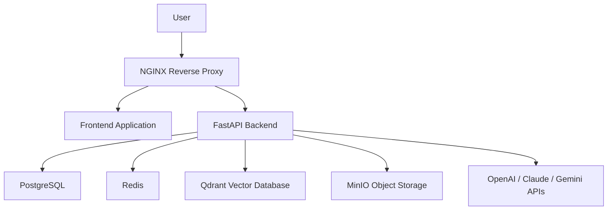
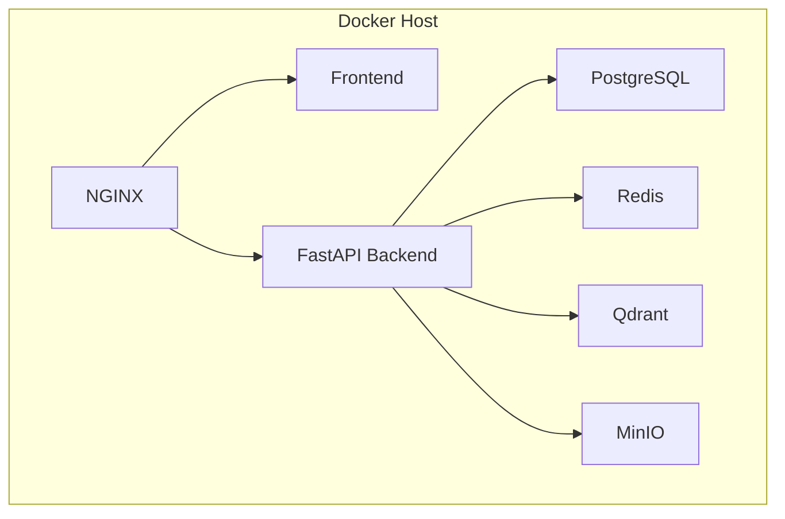
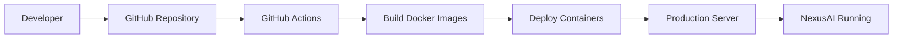
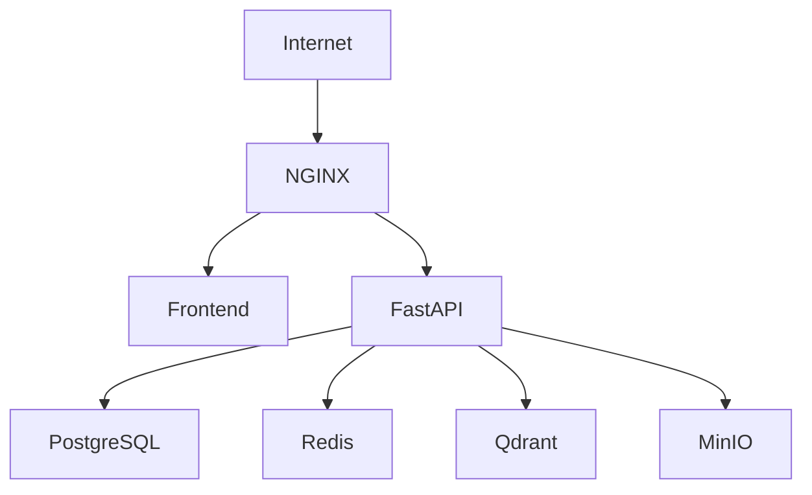

# Deployment Architecture

## 1. Overview

The Deployment Architecture defines how the NexusAI platform is deployed, managed, and operated in a production environment. It outlines the infrastructure components, deployment strategy, networking model, and security considerations required to ensure a reliable, scalable, and secure AI platform.

NexusAI follows a containerized deployment approach where each application component runs as an independent service. This architecture improves maintainability, enables horizontal scaling, simplifies updates, and provides better fault isolation between services.

The platform is designed using a modular architecture consisting of the frontend application, backend APIs, relational database, vector database, object storage, caching layer, reverse proxy, and external AI providers. Each service communicates through secure internal networking while exposing only the required public endpoints.

This document describes the complete deployment architecture of NexusAI, including production infrastructure, container organization, deployment workflow, networking, security, monitoring, and future deployment enhancements.

## 2. Deployment Goals

The deployment architecture has been designed to provide a secure, scalable, and production-ready environment capable of supporting enterprise AI workloads.

The primary deployment objectives include:

- Ensure high availability of platform services.
- Support horizontal scaling of backend services.
- Maintain complete isolation between application components.
- Protect internal services from unauthorized external access.
- Simplify deployment through containerization.
- Enable efficient resource utilization and fault isolation.
- Support secure communication between all services.
- Minimize deployment downtime during updates.
- Provide centralized monitoring and logging.
- Establish a deployment architecture that can evolve toward Kubernetes and cloud-native infrastructure in the future.

## 3. Production Deployment Architecture

NexusAI is deployed using a multi-container architecture where each core component operates as an independent service. This separation improves scalability, maintainability, and fault tolerance while allowing individual services to be upgraded or scaled independently.

Client requests are first received by the reverse proxy, which routes traffic to the appropriate backend services. The backend communicates with supporting infrastructure such as the relational database, vector database, cache, object storage, and external AI providers to process requests and generate responses.

The deployment architecture separates public-facing services from internal infrastructure. Only the frontend application and reverse proxy are exposed externally, while all backend infrastructure remains isolated within the internal application network.



This architecture provides a secure and scalable deployment model where each service performs a dedicated responsibility while remaining loosely coupled with the rest of the platform.

## 4. Infrastructure Components

The NexusAI platform consists of multiple infrastructure components, each responsible for a specific function within the system. By separating responsibilities into dedicated services, the platform becomes easier to maintain, scale, monitor, and secure.

| Component | Purpose |
|-----------|---------|
| Frontend Application | Provides the user interface for interacting with the platform. |
| NGINX Reverse Proxy | Routes incoming requests, serves static assets, and forwards API traffic to the backend. |
| FastAPI Backend | Handles authentication, document processing, AI workflows, business logic, and API requests. |
| PostgreSQL | Stores application metadata including users, organizations, documents, permissions, and system configurations. |
| Redis | Provides caching, temporary data storage, and supports background processing where required. |
| Qdrant Vector Database | Stores document embeddings and enables semantic search for Retrieval-Augmented Generation (RAG). |
| MinIO Object Storage | Stores uploaded documents, generated files, and other binary assets. |
| AI Providers | External Large Language Models such as OpenAI, Claude, and Gemini used for AI-powered capabilities. |
| Docker | Containerizes each service to ensure consistent deployment across environments. |

Each infrastructure component performs an independent responsibility while communicating securely through the internal application network. This modular architecture simplifies scaling, maintenance, and future expansion of the platform.

## 5. Container Architecture

NexusAI follows a containerized deployment model where every major service runs inside its own Docker container. Isolating services into independent containers improves fault tolerance, simplifies deployments, and allows each component to be scaled independently based on workload.

Each container exposes only the interfaces required for communication with other services while remaining isolated from the external network whenever possible.



### Container Responsibilities

- **NGINX** handles incoming HTTP/HTTPS traffic.
- **Frontend** serves the user interface.
- **Backend** processes business logic and AI workflows.
- **PostgreSQL** stores relational application data.
- **Redis** provides caching and temporary storage.
- **Qdrant** stores vector embeddings for semantic retrieval.
- **MinIO** stores uploaded documents and generated assets.

This architecture allows each service to be deployed, upgraded, monitored, and scaled independently without affecting the rest of the platform.

## 6. Deployment Workflow

The deployment workflow defines how application changes move from development to the production environment. NexusAI follows a container-based deployment process that ensures consistency, repeatability, and minimal deployment downtime.

### Deployment Pipeline



### Deployment Process

1. Developers push code changes to the GitHub repository.
2. GitHub Actions automatically validates the codebase and initiates the deployment pipeline.
3. Docker images are built for the updated application services.
4. Updated container images are deployed to the production server.
5. Existing containers are replaced with the newly built versions.
6. Health checks verify that all services are operating correctly.
7. Once validation succeeds, the updated platform becomes available to users.

This deployment strategy provides a consistent and automated release process while reducing deployment errors and simplifying application updates.

## 7. Networking

The NexusAI platform uses an isolated internal network to enable secure communication between application services while exposing only the necessary public endpoints. This approach minimizes the attack surface and prevents direct access to internal infrastructure components.

The NGINX Reverse Proxy acts as the single entry point for all incoming traffic. Client requests are received over HTTPS and routed to either the frontend application or the backend API based on the requested endpoint.

Internal services such as PostgreSQL, Redis, Qdrant, and MinIO are accessible only through the backend service and are never exposed directly to external users.



### Networking Principles

- NGINX is the only publicly accessible service.
- Backend APIs communicate with infrastructure through the internal Docker network.
- Database, cache, vector database, and object storage are isolated from public access.
- All service-to-service communication occurs within the private application network.
- External AI providers are accessed securely through authenticated HTTPS requests.

This networking model improves security, simplifies infrastructure management, and ensures controlled communication between all application components.

## 8. Security Considerations

Security is integrated into every layer of the NexusAI deployment architecture to protect application services, infrastructure resources, and user data. The deployment environment follows industry best practices to minimize security risks while maintaining operational flexibility.

### Network Security

- Only the NGINX Reverse Proxy is exposed to the public internet.
- Internal services remain isolated within the private Docker network.
- All communication between clients and the platform is encrypted using HTTPS.

### Application Security

- JWT-based authentication secures all protected API endpoints.
- Role-Based Access Control (RBAC) enforces authorization across platform resources.
- User passwords are securely hashed before storage.
- Sensitive operations are protected through authorization checks.

### Infrastructure Security

- Secrets such as API keys and database credentials are managed using environment variables.
- Database and object storage services are not directly accessible from external networks.
- Docker containers are isolated to reduce the impact of service failures or security incidents.

### Operational Security

- Authentication events and system activities are logged for auditing purposes.
- Rate limiting protects authentication endpoints from brute-force attacks.
- Regular updates and dependency patching help reduce known security vulnerabilities.
- Principle of Least Privilege is followed when assigning user roles and infrastructure permissions.

By implementing multiple layers of security, NexusAI provides a robust deployment architecture suitable for enterprise production environments.

## 9. Scalability Strategy

The deployment architecture is designed to support increasing workloads by allowing individual services to scale independently. Since the backend follows a stateless architecture, multiple application instances can run simultaneously without maintaining shared session state.

As user traffic grows, compute resources can be allocated to the services experiencing the highest demand without affecting the rest of the platform.

```mermaid
flowchart TD

NGINX

--> Backend 1

NGINX

--> Backend 2

NGINX

--> Backend 3

Backend 1 --> PostgreSQL

Backend 2 --> PostgreSQL

Backend 3 --> PostgreSQL

Backend 1 --> Redis

Backend 2 --> Redis

Backend 3 --> Redis

Backend 1 --> Qdrant

Backend 2 --> Qdrant

Backend 3 --> Qdrant
```

### Scalability Features

- Stateless backend services support horizontal scaling.
- Independent containers allow selective scaling of high-demand services.
- Redis reduces database load through caching.
- Qdrant efficiently handles large-scale vector search operations.
- Object storage scales independently for document management.
- Reverse proxy distributes incoming requests across multiple backend instances.

This architecture enables NexusAI to support enterprise workloads while maintaining high availability and consistent application performance.

## 10. Monitoring & Logging

Effective monitoring and centralized logging are essential for maintaining the reliability, availability, and operational health of the NexusAI platform. The deployment architecture incorporates monitoring mechanisms that provide visibility into system performance, infrastructure health, and application behavior.

Continuous monitoring enables administrators to detect issues proactively, analyze system performance, and respond quickly to failures before they impact end users.

### Monitoring Strategy

The platform continuously monitors the health and performance of all critical infrastructure components, including:

- Frontend Application
- FastAPI Backend
- PostgreSQL Database
- Redis Cache
- Qdrant Vector Database
- MinIO Object Storage
- NGINX Reverse Proxy

```mermaid
flowchart TD

Application Services

--> Metrics Collection

--> Monitoring System

--> Dashboards

--> Alerts

--> Operations Team
```

### Logging Strategy

Each application component generates structured logs that help developers and administrators troubleshoot issues, monitor application behavior, and perform security investigations.

The platform records logs for:

- Application startup and shutdown
- API requests and responses
- Authentication and authorization events
- Background task execution
- AI service interactions
- Database operations
- Infrastructure errors and exceptions

### Health Checks

Each service exposes health endpoints that enable automated monitoring systems to verify service availability and operational status.

Health checks include:

- Backend API availability
- Database connectivity
- Redis connectivity
- Vector database availability
- Object storage availability
- External AI provider connectivity

Implementing centralized monitoring and logging improves system reliability, accelerates incident response, and provides valuable operational insights for maintaining production environments.

## 11. Future Enhancements

The current deployment architecture provides a stable and production-ready foundation for the NexusAI platform. As the platform evolves, additional infrastructure capabilities can be introduced to improve scalability, reliability, automation, and operational efficiency.

### Cloud-Native Deployment

Migrate from single-server deployments to managed cloud platforms such as AWS, Microsoft Azure, or Google Cloud to improve availability and simplify infrastructure management.

### Kubernetes Orchestration

Adopt Kubernetes for automated container orchestration, service discovery, rolling updates, self-healing, and horizontal scaling of application services.

### Auto Scaling

Implement automatic scaling policies that dynamically adjust backend resources based on CPU utilization, memory consumption, or request volume.

### CI/CD Enhancements

Extend the deployment pipeline with automated testing, security scanning, container image validation, and zero-downtime deployment strategies.

### Disaster Recovery

Introduce automated backup and recovery mechanisms for databases, object storage, and vector databases to improve business continuity and data protection.

### Advanced Monitoring

Integrate enterprise monitoring solutions such as Prometheus and Grafana to provide real-time metrics, performance dashboards, infrastructure alerts, and capacity planning insights.

### High Availability

Deploy multiple backend instances behind a load balancer to eliminate single points of failure and improve overall platform resilience.

### Multi-Region Deployment

Support deployment across multiple geographic regions to reduce latency, improve disaster recovery capabilities, and provide higher availability for global users.

These enhancements will enable NexusAI to evolve from a production-ready application into a highly available, cloud-native enterprise platform capable of supporting large-scale AI workloads while maintaining reliability, security, and operational excellence.